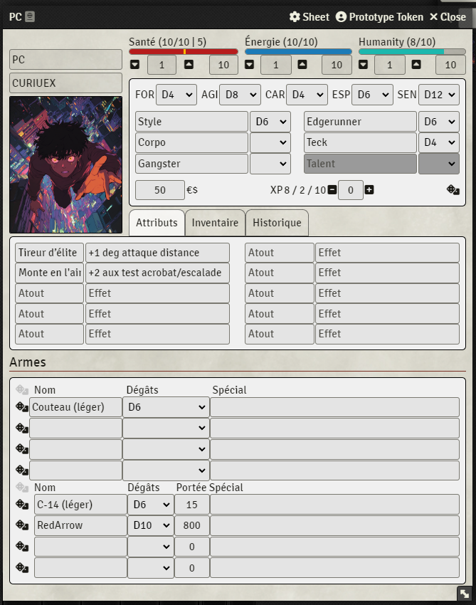

# F.A.C.E.S. - Foundry VTT System

F.A.C.E.S. is a french TTRPG made by `James Tornade`.

This character sheet is not an official one, its purpose is to provide an easy-to-use synthetic sheet for my DM's.

## Install

### Manual Install

[Latest Release](https://github.com/monnierant/FACES/releases/latest/download/system.json)

## Usage

## optional feature

### Currency

Custom symbol can be defined and currency can also be spread in 3 kind

it can be enable in `settings/F.A.C.E.S./Currency`

### Stat bar

A third statistic bar with custom name can be added

it can be enable in `settings/F.A.C.E.S./Enable Extra Gauge`

### Tallent Tooltip

a small description for the tallent can be added

it can be enable in `settings/F.A.C.E.S./Show Talent Tooltip`

